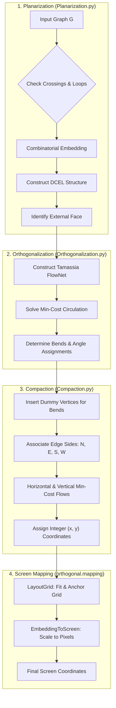
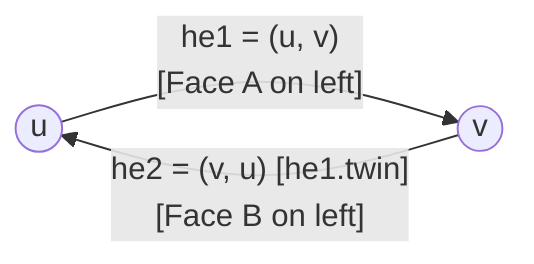
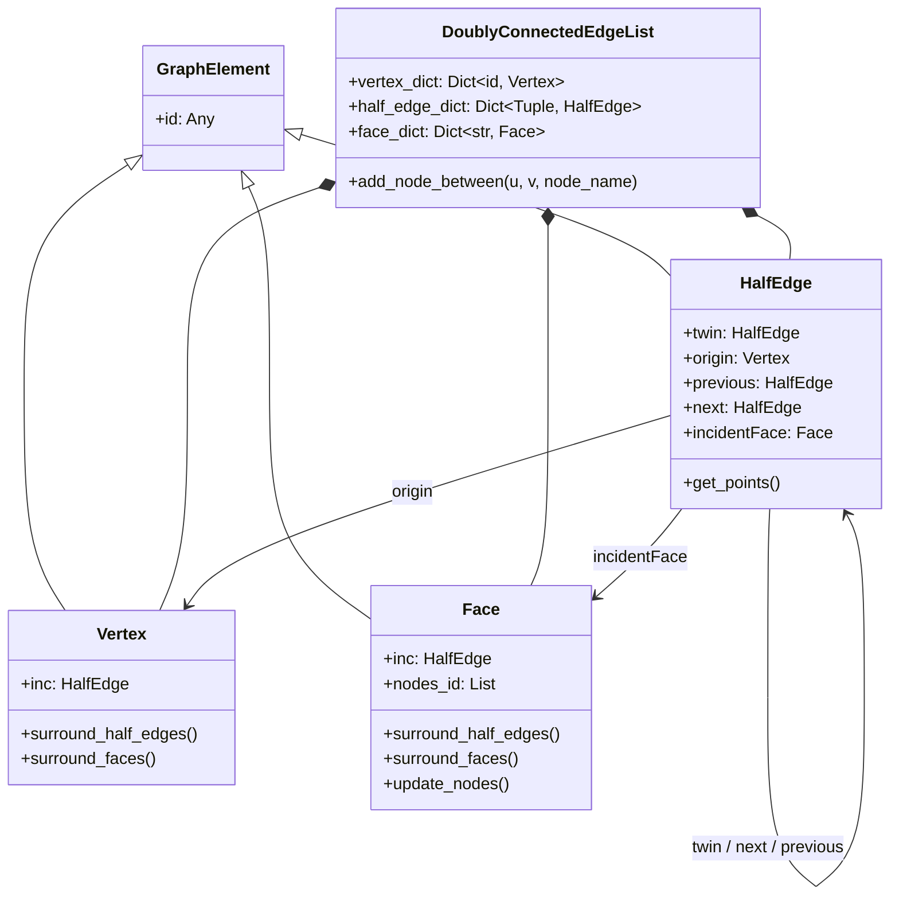
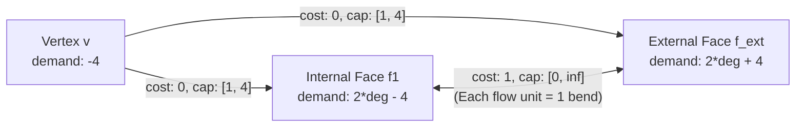
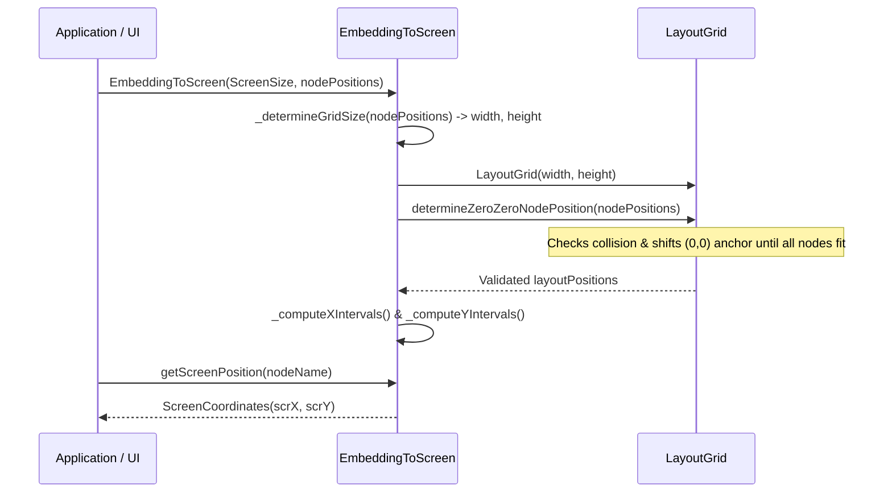

# Technical Architecture: Orthogonal Graph Layout

The `orthogonal` package is a Python library that calculates orthogonal graph drawings using the classic **Topology-Shape-Metric (TSM)** approach. In an orthogonal drawing, graph vertices are placed on an integer grid, and edges are routed along alternating horizontal and vertical line segments with a minimum number of right-angle bends and no edge crossings.

---

## 1. System Overview & Pipeline Architecture

The drawing pipeline processes a graph through four distinct stages:

---

## 2. Core Modules and Topological Data Structures

### 2.1 Doubly-Connected Edge List (DCEL)

The package relies on a custom DCEL (`orthogonal.doublyConnectedEdgeList`) to maintain the topological planar embedding. Every undirected edge {u, v} is split into two directed half-edges: `(u, v)` and `(v, u)`.

#### Why Split into Directed Half-Edges?
In standard graph representations, an undirected edge only denotes connectivity between vertices. In planar geometry and orthogonal layout, edges also serve as boundaries between 2D polygonal regions called **faces**:

1. **Dual Face Boundaries:**
   - An edge {u, v} typically separates two adjacent faces (or borders the same face twice in tree bridges).
   - Each face boundary is an oriented cycle of directed edges (counter-clockwise for internal faces).
   - Travel along the boundary of Face A moves from u → v, whereas travel along Face B moves in the opposite direction from v → u. A single undirected edge cannot point in both directions simultaneously. Splitting {u, v} into two opposing half-edges (`(u, v)` with Face A on its left, and `(v, u)` with Face B on its left) resolves this conflict.
2. **Constant-Time (O(1)) Topological Navigation:**
   - **Walk face boundary:** `he.succ` advances to the next counter-clockwise half-edge enclosing the same face.
   - **Rotate around a vertex:** `he.twin.succ` cycles to the next edge incident to the origin vertex in circular order.
   - **Access adjacent face:** `he.twin.inc` directly accesses the face on the other side of the edge.
3. **Modeling Edge Bends as Flow:**
   - In Tamassia's orthogonalization network flow, a 90° bend on an edge is represented as units of flow passing across the edge between its left face `he.twin.inc` and right face `he.inc`. Having explicit half-edges makes assigning and tracking directional bend flows straightforward.
4. **Opposing Cardinal Directions:**
   - In compaction, moving from u → v along `(u, v)` is assigned a cardinal direction (e.g. East / side 1), whereas moving from v → u along `(v, u)` is assigned the exact opposite direction (West / side 3).

- [`Vertex`](file:///Users/humberto.a.sanchez.ii/PycharmProjects/orthogonal/src/orthogonal/doublyConnectedEdgeList/Vertex.py): Holds an `inc` pointer to an outgoing half-edge.
- [`HalfEdge`](file:///Users/humberto.a.sanchez.ii/PycharmProjects/orthogonal/src/orthogonal/doublyConnectedEdgeList/HalfEdge.py): Half-edge with pointers to its `twin`, `next` (next counter-clockwise edge on face boundary), `previous` (preceding edge), `origin` (origin vertex), and `incidentFace` (incident face to its left).
- [`Face`](file:///Users/humberto.a.sanchez.ii/PycharmProjects/orthogonal/src/orthogonal/doublyConnectedEdgeList/Face.py): Holds an `inc` pointer to one half-edge on its bounding cycle.
- [`DoublyConnectedEdgeList.add_node_between`](file:///Users/humberto.a.sanchez.ii/PycharmProjects/orthogonal/src/orthogonal/doublyConnectedEdgeList/DoublyConnectedEdgeList.py#L53): Dynamically splits an existing half-edge pair by introducing a dummy bend vertex `b_i`, rewiring `next`, `previous`, and `twin` pointers while updating the bounding face cycles.

---

## 3. The 3-Stage Topology-Shape-Metric (TSM) Engine

### 3.1 Stage 1: Planarization (`Planarization.py`)

- **Constraint Validation:** Asserts that G is connected and has no self-loops. All vertices must have maximum degree ≤ 4 to permit an orthogonal drawing on a 4-regular grid.
- **Embedding Generation:** If initial 2D positions `pos` are supplied, it verifies that no edges intersect using cross-product segments ([`Planarization.numberOfCrossings`](file:///Users/humberto.a.sanchez.ii/PycharmProjects/orthogonal/src/orthogonal/topologyShapeMetric/Planarization.py#L83)) and orders neighbors counter-clockwise around each vertex. If no positions are supplied, it invokes `networkx.check_planarity(G)` to obtain a combinatorial planar embedding.
- **External Face Identification ([`Planarization.get_external_face`](file:///Users/humberto.a.sanchez.ii/PycharmProjects/orthogonal/src/orthogonal/topologyShapeMetric/Planarization.py#L55)):** Finds the leftmost/bottommost vertex and computes the vector with maximum cosine to identify the bounding outer half-edge and external face f_ext.

---

### 3.2 Stage 2: Orthogonalization (`Orthogonalization.py` & `FlowNet.py`)

Orthogonalization fixes the shape (angles and edge bends) by casting the problem as a **minimum-cost circulation problem** over a network flow graph ([`FlowNet`](file:///Users/humberto.a.sanchez.ii/PycharmProjects/orthogonal/src/orthogonal/topologyShapeMetric/FlowNet.py)):

#### Flow Network Construction
Let unit flow represent an angle of π/2 (90°):
1. **Vertex Supply:** Each vertex v produces a supply of 4 units (corresponding to 2π = 4 × π/2). Thus, `demand = -4`.
2. **Face Demand:** 
   - Internal face f: has demand 2 × deg(f) - 4.
   - External face f_ext: has demand 2 × deg(f_ext) + 4.
3. **Vertex-to-Face Edges (v → f):** Lower bound 1, capacity 4, cost 0. Represents allocating right angles inside face f at vertex v.
4. **Face-to-Face Edges (f1 → f2):** For each half-edge separating adjacent faces, lower bound 0, capacity ∞, cost 1. Each unit of flow across this edge represents a 90° bend on the edge.

- **Solution via `min_cost_flow`:** [`FlowNet.min_cost_flow()`](file:///Users/humberto.a.sanchez.ii/PycharmProjects/orthogonal/src/orthogonal/topologyShapeMetric/FlowNet.py#L22) transforms non-zero lower bounds into standard minimum-cost circulation format and solves via NetworkX's simplex-based flow algorithm.
- **Alternative LP Formulation:** [`Orthogonalization.lp_solve()`](file:///Users/humberto.a.sanchez.ii/PycharmProjects/orthogonal/src/orthogonal/topologyShapeMetric/Orthogonalization.py#L50) provides an integer programming formulation via PuLP with penalties for non-symmetric paths and corners.

---

### 3.3 Stage 3: Compaction (`Compaction.py`)

Compaction calculates the integer lengths of all horizontal and vertical segments to minimize total area and edge length:

1. **Dummy Bend Insertion ([`bend_point_processor`](file:///Users/humberto.a.sanchez.ii/PycharmProjects/orthogonal/src/orthogonal/topologyShapeMetric/Compaction.py#L37)):**
   - For every edge with k > 0 bends from the orthogonalization flow, dummy vertices b0, b1, ..., b_{k-1} are inserted into G and the DCEL.
   - The original edge is replaced by k + 1 straight segments.
2. **Face Side Assignment ([`face_side_processor`](file:///Users/humberto.a.sanchez.ii/PycharmProjects/orthogonal/src/orthogonal/topologyShapeMetric/Compaction.py#L74)):**
   - Traverses face cycles and assigns each directed half-edge an orientation side: `0` (North / Up), `1` (East / Right), `2` (South / Down), `3` (West / Left).
   - Traverses the dual face graph in DFS order to propagate consistent global orientations.
3. **Tidy Rectangle Compaction ([`tidy_rectangle_compaction`](file:///Users/humberto.a.sanchez.ii/PycharmProjects/orthogonal/src/orthogonal/topologyShapeMetric/Compaction.py#L117)):**
   - Constructs two independent DAG flow networks:
     - `ver_flow` (vertical segments, left-to-right flow).
     - `hor_flow` (horizontal segments, top-to-bottom flow).
   - Solves minimum-cost flow with edge weights = 1 and lower bound = 1 to assign the optimal length (`len`) to each edge.
4. **Grid Coordinates Calculation ([`layout`](file:///Users/humberto.a.sanchez.ii/PycharmProjects/orthogonal/src/orthogonal/topologyShapeMetric/Compaction.py#L180)):**
   - Anchors the initial vertex at (0, 0) and traces faces along the assigned side and length vectors, outputting relative integer coordinates for all vertices and bend nodes: `self.pos[node] = (x, y)`.

---

## 4. Screen Mapping Layer (`orthogonal.mapping`)

Once integer grid coordinates are calculated, the mapping subpackage translates them to target pixel coordinates for UI rendering:

- [`LayoutGrid`](file:///Users/humberto.a.sanchez.ii/PycharmProjects/orthogonal/src/orthogonal/mapping/LayoutGrid.py): Normalizes grid coordinates that may have negative indices or awkward offsets. It shifts the origin across candidate grid cells until all nodes occupy collision-free cells without `KeyError` boundaries.
- [`EmbeddingToScreen`](file:///Users/humberto.a.sanchez.ii/PycharmProjects/orthogonal/src/orthogonal/mapping/EmbeddingToScreen.py): Divides the available screen canvas (`ScreenSize(width, height)`) into uniform interval slots and maps each grid integer to a physical pixel coordinate.

---

## 5. Algorithmic Invariants and Limits

- **Degree Limit:** Maximum node degree must be ≤ 4. Vertices with degree > 4 cannot have an orthogonal grid embedding without expanding the vertex into an area or polygon.
- **Connectivity:** G must be connected (`nx.is_connected(G)`). Disconnected components must be partitioned, embedded individually, and packed.
- **Self-Loops:** Self-loops are prohibited (`nx.number_of_selfloops(G) == 0`).
- **Planarity:** For planar layouts, edge crossings must be 0 or planarized (crossings replaced by dummy intersection vertices).

---

## 6. References

- Tamassia, Roberto. *"On embedding a graph in the grid with the minimum number of bends."* SIAM Journal on Computing 16.3 (1987): 421-444.
- Grokipedia reference on *Orthogonal Graph Drawing* and *Topology-Shape-Metric Approach*.
